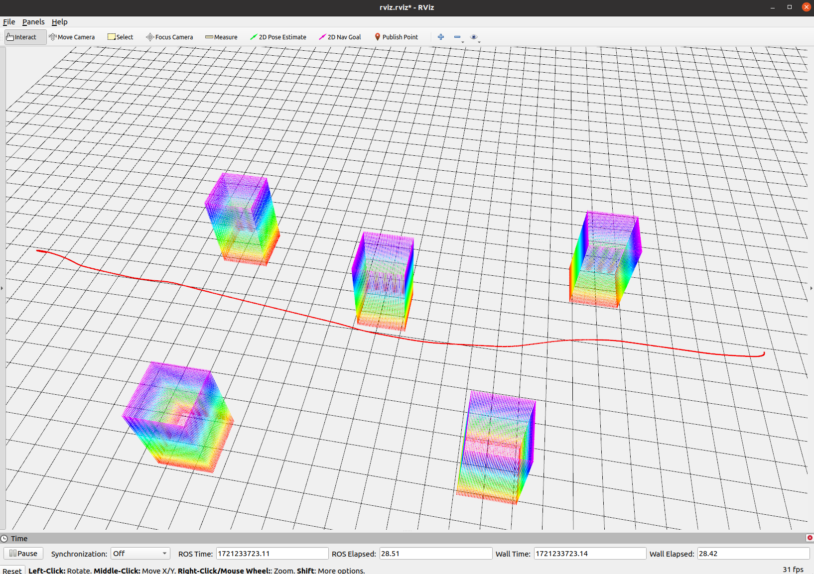

## Dynamic Astar

This repository provides a framework for dynamic Astar (also known as dynamic A*, kinodynamic Astar, knodynamic A*) path searching in a 3D point cloud map.

Dynamic Astar is a common path search algorithm, but there is a lack of a unified framework. Although there are many related repositories on GitHub, very few of them worked and met my expectations.

Based on a great algorithm, Fast-Planner, I extracted the path search method and made it compatible with the point cloud map.

More development details can be found in the ## Development section.


## Quick Start

<p align="center">
  
</p>


**Step 1**: Download the dependencies
```shell
sudo apt update
sudo apt install ros-$ROS_DISTRO-octomap
sudo apt install ros-$ROS_DISTRO-octomap-server
sudo apt install ros-$ROS_DISTRO-pcl-ros
```

**Step 2**: Initialize the repo and compile
```shell
git clone https://github.com/Dwl2021/Dynamic-Astar.git
cd Dynamic-Astar
catkin_make
```

**Step 3**: Run the program
```shell
./run.sh
```

## Parameters

### Set start and goal

Modify in `src/dyn_astar_test/launch/example.launch`
```cpp
Eigen::Vector3d start(0, 0, 1);
Eigen::Vector3d start_vel(0, 0, 0);
Eigen::Vector3d start_acc(0, 0, 0);
Eigen::Vector3d goal(30, 0, 1);
Eigen::Vector3d goal_vel(-2, 0, 0);
```

### Path search parameters

Modify in `src/dyn_astar_test/launch/kastar.xml`

### Map

Modify in `src/dyn_astar_test/pcd` and if you want to make your own map, more details can be found in `src/dyn_astar_test/pcd/map_generation`.

## Development

If you want to change your own point cloud, please modify the frame to `world` and the topic to `/global_map`. Possibly, you might find the path crossing through the point cloud; there may be several reasons:

1. The point cloud is too sparse.
2. The max velocity is too large.
3. The max_tau is too large, which depends on the step time.

Or you can modify the `map_util.h` file. Search for the `expand_size` variables and set them to 1, 2, or 3.

If you want to adjust the size of map, please pay attention to the origin point in `map_util.h`
```cpp
origin_d_[0] = -map_size(0) / 2;
origin_d_[1] = -map_size(1) / 2;
origin_d_[2] = 0;
```

## Reference

Based on the project [Fast-Planner](https://github.com/HKUST-Aerial-Robotics/Fast-Planner).
